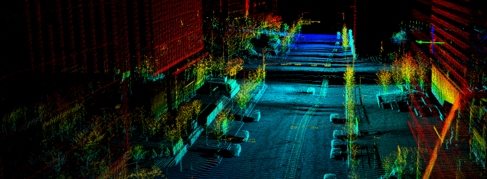

# 3D Point Cloud Processing

## 介绍

本仓库收集了一些个人学习的点云处理算法代码，主要包含：

- **传统点云处理算法**
- **基于深度学习的点云处理**

## 目录

- [week1](./week1)：点云PCA分析，体素滤波
- [week2](./week2)：Kd-tree，Octree
- [week3](./week3)：聚类算法（K-Means/GMM/SpectralCluster）
- [week4](./week4)：KITTI激光点云处理（地面点云估计、点云聚类）
- [week5](./week5)：PointNet点云分类
- [week6](./week6)：3D目标检测及精度评估
- [week7](./week7)：3D特征点提取
- [week8](./week8)：3D特征描述
