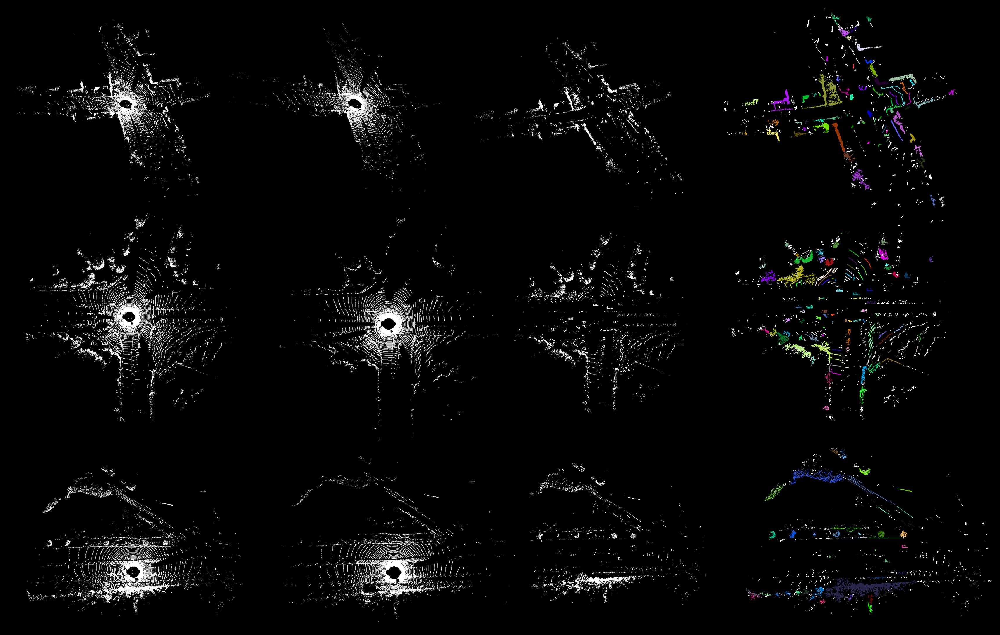
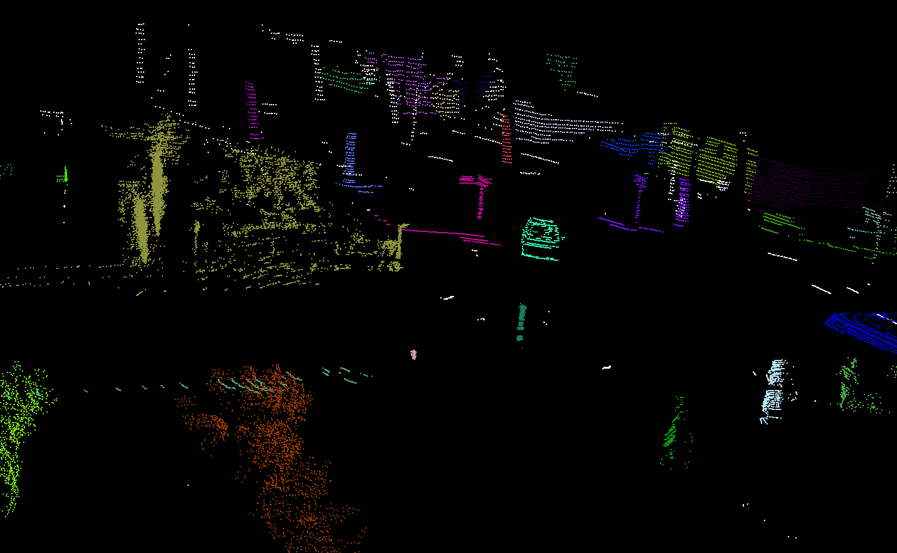

# KITTI激光点云处理（地面点云估计、点云聚类）

## 数据

程序使用KITTI 3D目标检测数据集，下载地址和详细的介绍见官网: http://www.cvlibs.net/datasets/kitti/eval_object.php?obj_benchmark=3d

## 编译与运行

依赖以下第三方库：

- PCL。用于算法实现和可视化

编译方法如下，编译成功后可执行文件会在`bin`文件夹中生成，库文件会在`lib`文件夹中生成：

```bash
git clone https://github.com/gjgjh/PointCloudPractice
cd PointCloudPractice/week4/practice01
mkdir build
cd build
cmake ..
make -j4
```

## 示例结果

- `testGroundPointRemoval.cpp`：利用RANSAC法对点云中地面进行估计并剔除。

- `testPointCloudClustering.cpp`：剔除地面点云后，对点云进行聚类。

结果如下图所示。其中，第一列为KITTI原始点云数据，第二列为估计的地面点云数据，第三列为去除地面点云后点云数据，第四列为点云聚类结果（不同类别用不同颜色表示）。



聚类效果细节部分如下图所示：



## TODO

- 目前使用的RANSAC法在部分数据上效果不错，但在一些数据上表现效果一般。后续可以考虑加入传感器高度等参数，进一步改进地面点云估计算法。