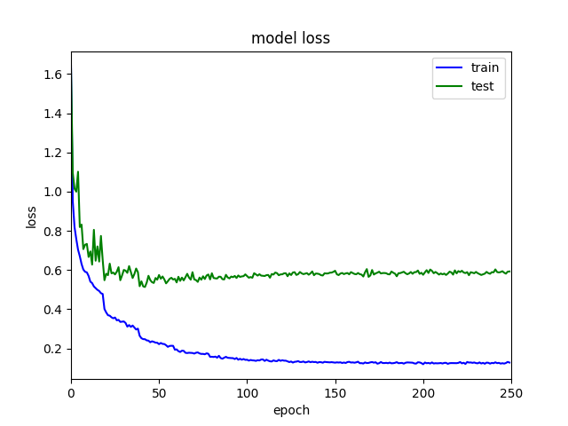
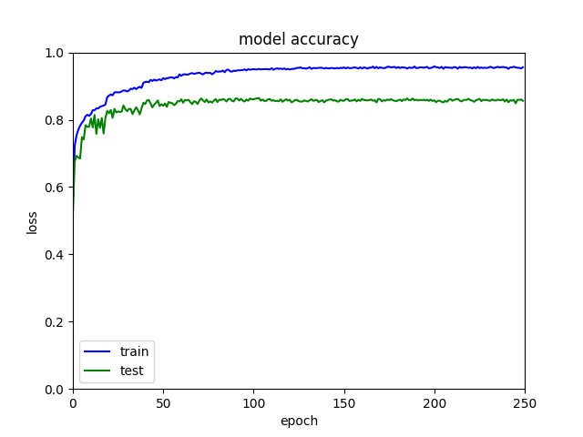

# PointNet

使用Pytorch实现简单的PointNet https://arxiv.org/abs/1612.00593 ，对点云数据（ModelNet40数据集）进行分类。为简便起见，网络结构稍微有所改动，并且不包含特征变换模块。程序的实现部分参考 https://github.com/fxia22/pointnet.pytorch

## 依赖库

依赖以下第三方库，通过pip等包管理器可以安装：

- PyTorch 用于网络构建 （本程序已在PyTorch 1.7上进行测试）
- matplotlib 用于绘图

## 数据

ModelNet数据集下载和解压：

```bash
wget https://shapenet.cs.stanford.edu/media/modelnet40_normal_resampled.zip --no-check-certificate
unzip modelnet40_normal_resampled
```

## 示例结果

`train.py`：在ModelNet40数据集上训练PointNet，并输出训练和测试精度。

训练250个epoch后，训练loss为0.128，测试loss为**0.593**。如下图所示：



训练250个epoch后，训练精度为0.956，测试精度为**0.856**。如下图所示：

