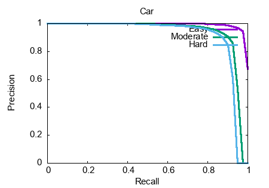
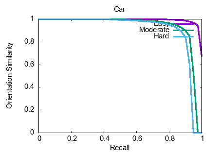
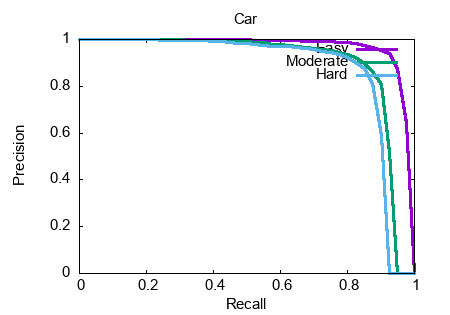
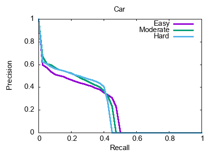

# 3D目标检测及精度评估

## 目标检测

利用开源三维目标检测框架PointRCNN https://github.com/sshaoshuai/PointRCNN 在[KITTI 3D目标检测数据集](http://www.cvlibs.net/datasets/kitti/eval_object.php?obj_benchmark=3d)上进行训练和预测。

### 数据组织

将KITTI数据集按以下形式组织：

```bash
PointRCNN
├── data
│   ├── KITTI
│   │   ├── ImageSets
│   │   ├── object
│   │   │   ├──training
│   │   │      ├──calib & velodyne & label_2 & image_2 & (optional: planes)
│   │   │   ├──testing
│   │   │      ├──calib & velodyne & image_2
├── lib
├── pointnet2_lib
├── tools
```

### 训练

PointRCNN训练部分详见其[README](https://github.com/sshaoshuai/PointRCNN)。此外，原仓库提供了一个预训练的权重可以使用。

### 预测

在`PointRCNN/tools`文件夹下运行：

```
python eval_rcnn.py --cfg_file cfgs/default.yaml --ckpt PointRCNN.pth --batch_size 1 --eval_mode rcnn --set RPN.LOC_XZ_FINE False
```

预测结果的输出目录为`PointRCNN/output/rcnn/default/eval/epoch_no_nuber/val/final_result/data`，输出格式为KITTI标准格式，详细见官网。

## 精度评估

利用开源三维目标检测评估工具 https://github.com/prclibo/kitti_eval 对预测结果进行评估。

### 数据组织

将groundtruth和预测结果按以下形式组织：

```bash
label_2  (groundtruth folder in KITTI dataset)
     |----000000.txt
     |----000001.txt
     
final_result (prediction folder)
     |----data
            |----000000.txt
            |----000001.txt
```

### 编译与运行

编译和依赖安装方式为：

```bash
g++ -O3 -DNDEBUG -o evaluate_object_3d_offline evaluate_object_3d_offline.cpp
sudo apt-get install gnuplot
sudo apt-get install texlive-extra-utils # Mac下则需安装mactex
```

运行方式为：

```bash
./evaluate_object_3d_offline label_2 final_result
```

### 示例结果

示例结果如下：

```bash
Thank you for participating in our evaluation!
Loading detections...
number of files for evaluation: 3769
  done.
save /Users/huiguo/Desktop/final_result/plot/car_detection.txt
car_detection AP: 96.911911 89.531288 88.749985
fontconfig: Didn't find expected font family. Perhaps URW Type 1 fonts need installing? when opening font Helvetica, trying default
PDFCROP 1.38, 2012/11/02 - Copyright (c) 2002-2012 by Heiko Oberdiek.
==> 1 page written on `car_detection.pdf'.
save /Users/huiguo/Desktop/final_result/plot/car_orientation.txt
car_orientation AP: 96.902977 89.406799 88.545616
fontconfig: Didn't find expected font family. Perhaps URW Type 1 fonts need installing? when opening font Helvetica, trying default
PDFCROP 1.38, 2012/11/02 - Copyright (c) 2002-2012 by Heiko Oberdiek.
==> 1 page written on `car_orientation.pdf'.
save /Users/huiguo/Desktop/final_result/plot/car_detection_ground.txt
car_detection_ground AP: 90.222801 87.899277 85.523643
fontconfig: Didn't find expected font family. Perhaps URW Type 1 fonts need installing? when opening font Helvetica, trying default
PDFCROP 1.38, 2012/11/02 - Copyright (c) 2002-2012 by Heiko Oberdiek.
==> 1 page written on `car_detection_ground.pdf'.
save /Users/huiguo/Desktop/final_result/plot/car_detection_3d.txt
car_detection_3d AP: 89.200951 78.853203 77.914848
fontconfig: Didn't find expected font family. Perhaps URW Type 1 fonts need installing? when opening font Helvetica, trying default
PDFCROP 1.38, 2012/11/02 - Copyright (c) 2002-2012 by Heiko Oberdiek.
==> 1 page written on `car_detection_3d.pdf'.
Your evaluation results are available at:
/Users/huiguo/Desktop/final_result
```

绘制的Precision-Recall曲线（car_detection）如下图所示：



绘制的Precision-Recall曲线（car_orientation）如下图所示：



绘制的Precision-Recall曲线（car_detection_ground）如下图所示：



绘制的Precision-Recall曲线（car_detection_3d）如下图所示：



