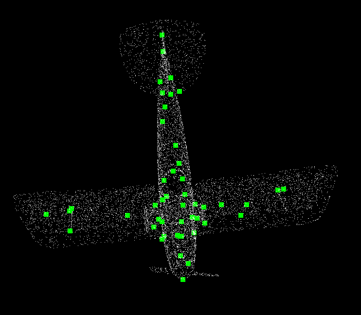
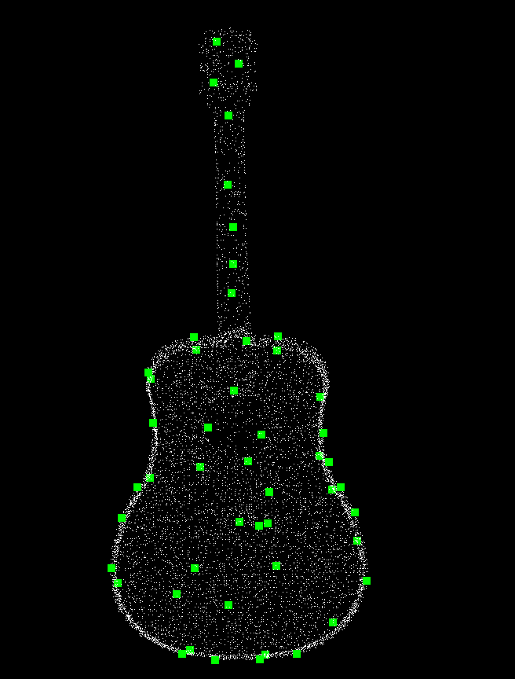
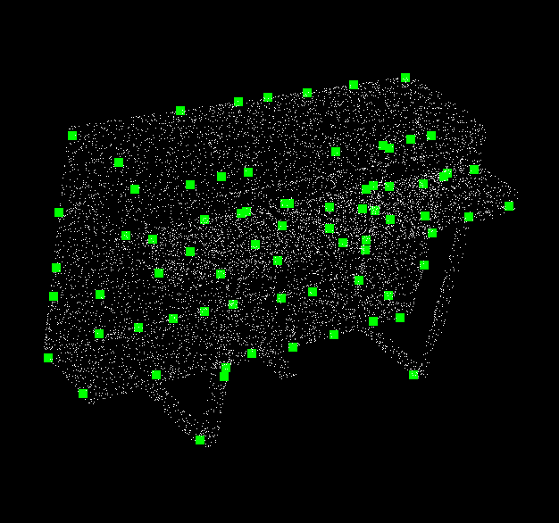

# 3D特征点提取

使用Intrinsic Shape Signatures (ISS)算子对点云数据进行特征点提取。ISS算法：

Zhong, Yu. "Intrinsic shape signatures: A shape descriptor for 3d object recognition." 2009 IEEE 12th International Conference on Computer Vision Workshops, ICCV Workshops. IEEE, 2009.

## 编译与运行

依赖以下第三方库：

- Eigen。矩阵相关运算，主要用于算法实现
- libnabo (Thirdparty文件夹下)。用于KNN搜索
- PCL。用于**可视化**

编译方法如下，编译成功后可执行文件会在`bin`文件夹中生成：

```bash
git clone https://github.com/gjgjh/PointCloudPractice
cd PointCloudPractice/week7
chmod +x build.sh
./build.sh
```

## 示例结果

- `testISS.cpp`：利用RANSAC法对点云中地面进行估计并剔除。

对[ModelNet40](https://shapenet.cs.stanford.edu/media/modelnet40_normal_resampled.zip)数据集进行测试，结果如下图所示





