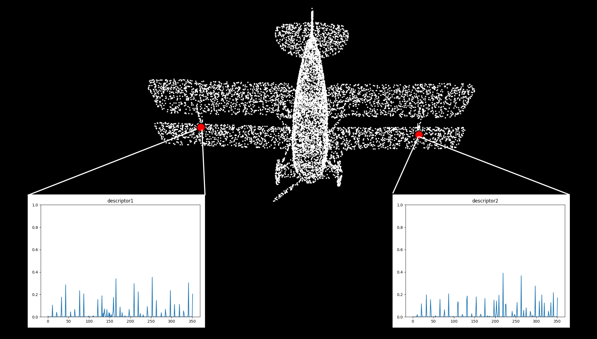

# 3D特征描述

使用FPFH算子（个人实现）和SHOT算子（PCL库）对点云数据进行特征点描述。FPFH算法：

Rusu, Radu Bogdan, Nico Blodow, and Michael Beetz. "Fast point feature histograms (FPFH) for 3D registration." *2009 IEEE international conference on robotics and automation*. IEEE, 2009.

SHOT算法：

Tombari, Federico, Samuele Salti, and Luigi Di Stefano. "Unique signatures of histograms for local surface description." *European conference on computer vision*. Springer, Berlin, Heidelberg, 2010.

`data`文件夹下提供了ModelNet40示例数据，更多数据集可以点击[链接](https://shapenet.cs.stanford.edu/media/modelnet40_normal_resampled.zip)下载。

## 编译与运行

依赖以下第三方库：

- Eigen。矩阵相关运算，主要用于算法实现
- PCL。FPFH算子中仅用于KNN搜索和可视化部分，SHOT算子中用于特征描述和可视化。

编译方法如下，编译成功后可执行文件会在`bin`文件夹中生成：

```bash
git clone https://github.com/gjgjh/PointCloudPractice
cd PointCloudPractice/week8
mkdir build
cd build
cmake ..
make -j4
```

另外，`scripts`文件夹下提供了可视化描述子的脚本文件。

## 示例结果

- `testFPFH.cpp`：利用个人实现的FPFH算子对点云中指定两个点进行特征描述，并保存描述向量文件。利用Python脚本对描述向量可视化结果如下，可以看到两个点描述子比较相近：


- `testSHOT.cpp`：利用PCL自带的SHOT算子对点云中指定两个点进行特征描述，并保存描述向量文件。利用Python脚本对描述向量可视化结果如下，可以看到两个点描述子比较相近：




## TODO

- 优化FPFH的效率，避免重复计算等情况。
- 自己实现SHOT352描述子。

